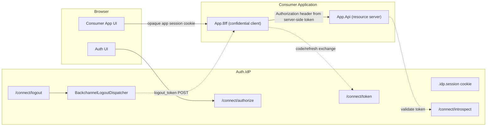
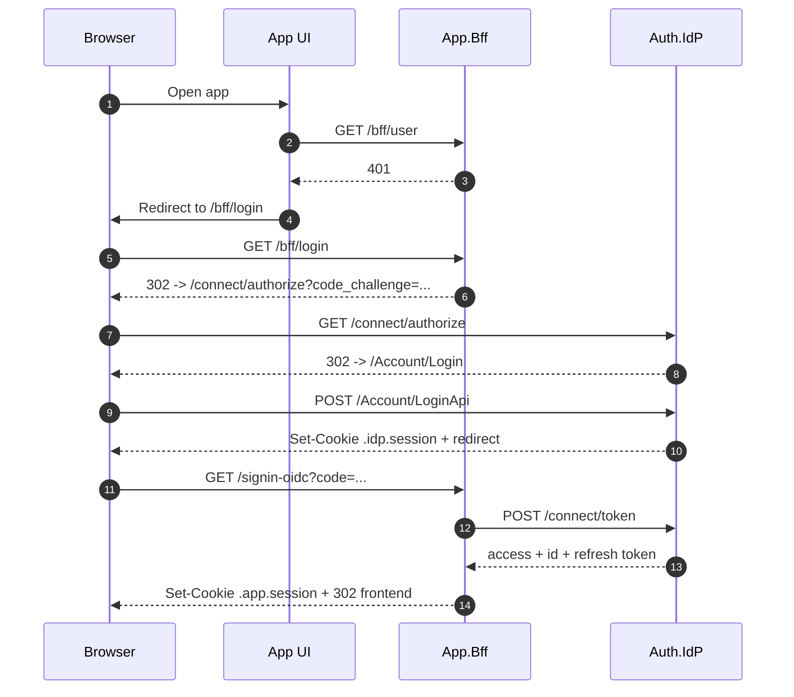
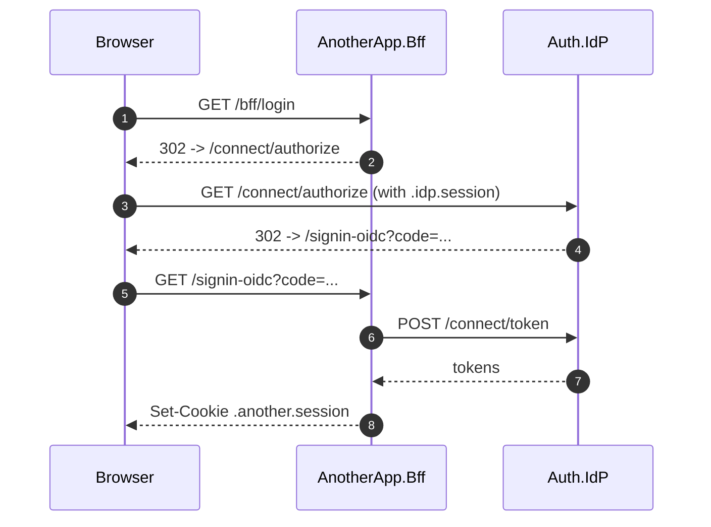
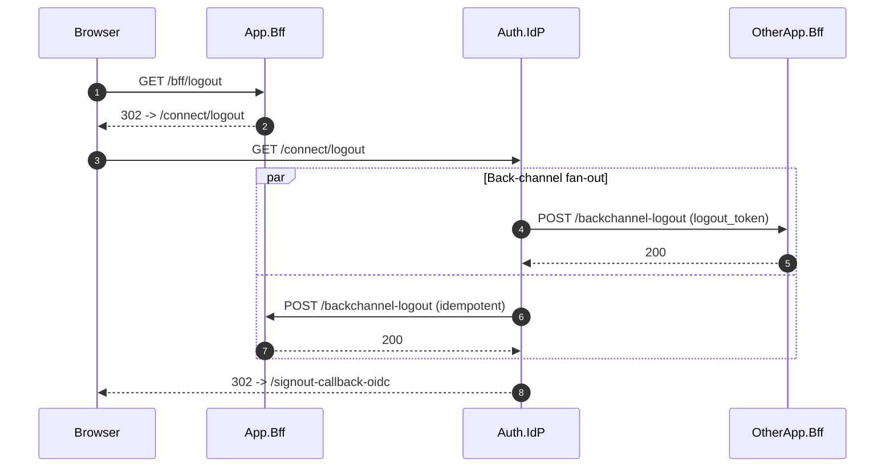

# SSO Auth Flow Diagrams

Visual companion to [AUTH-FLOWS.md](AUTH-FLOWS.md). Render in any Mermaid-aware viewer.

---

## 1. Component / topology map

---

## 2. First login — no existing session

---

## 3. SSO login in another application

---

## 4. Single logout (back-channel)

