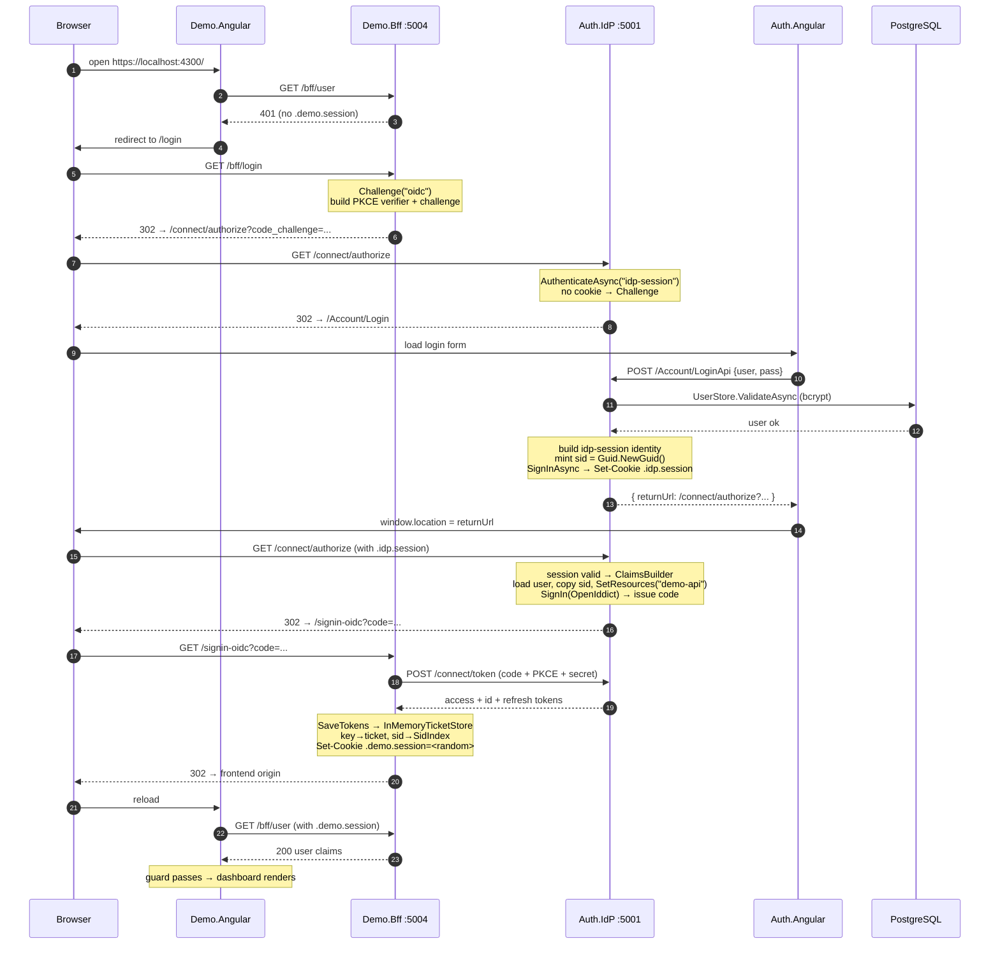
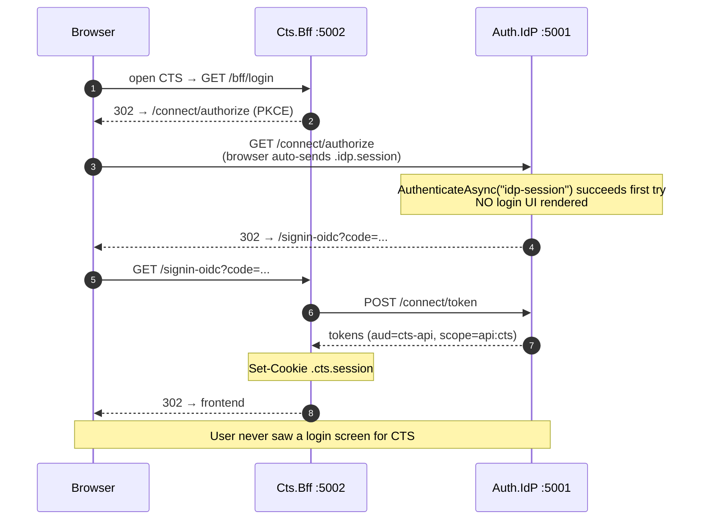
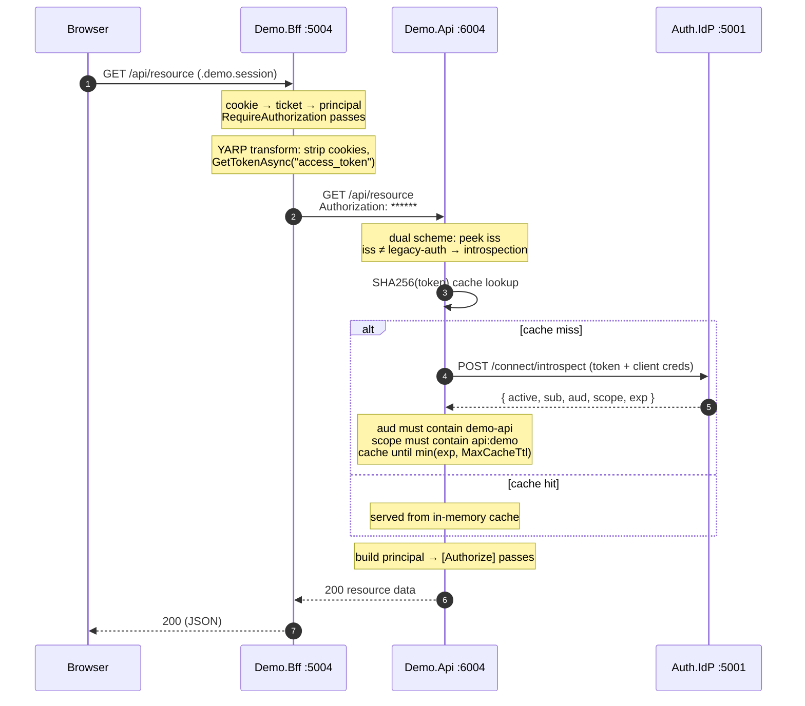
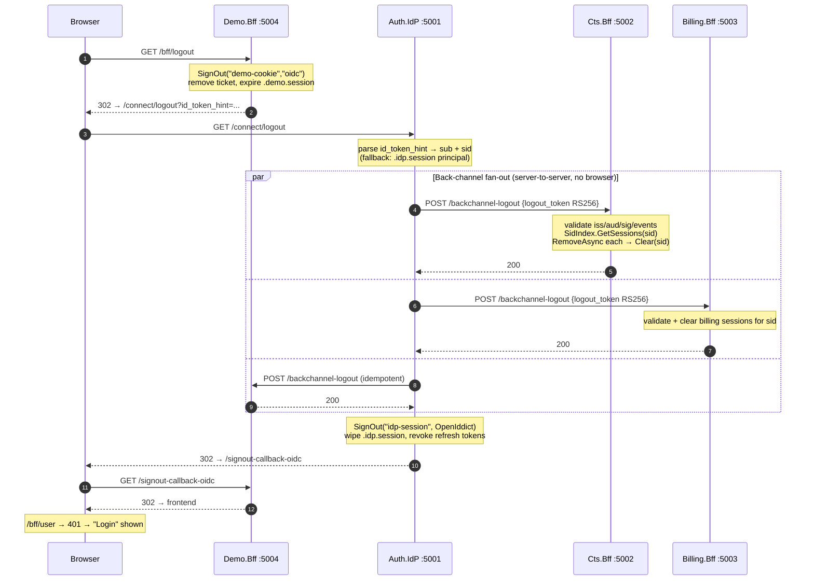
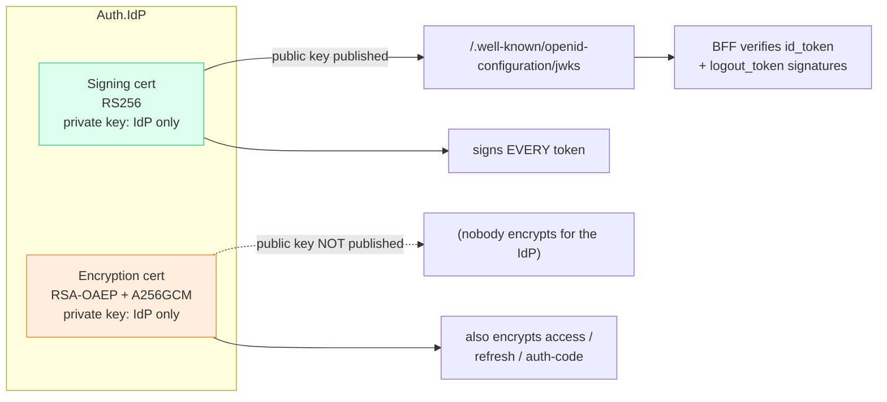
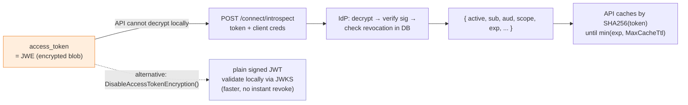
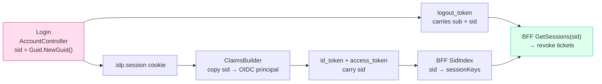

# SSO Auth Flow Diagrams

Visual companion to [AUTH-FLOWS.md](AUTH-FLOWS.md). Render in any Mermaid-aware
viewer (VS Code Markdown preview, GitHub, etc.).

---

## 1. Component / topology map

```mermaid
flowchart LR
    subgraph Browser
        AuthNg["Auth.Angular<br/>(login page)"]
        CtsNg["Cts.Angular<br/>:4200"]
        BillNg["Billing.Angular"]
        DemoNg["Demo.Angular<br/>:4300"]
    end

    subgraph IdP["Auth.IdP :5001"]
        IdPcookie[".idp.session cookie<br/>= the SSO"]
        Authorize["/connect/authorize"]
        Token["/connect/token"]
        Introspect["/connect/introspect"]
        Logout["/connect/logout"]
        Dispatcher["BackchannelLogoutDispatcher"]
    end

    subgraph CTS["CTS"]
        CtsBff["Cts.Bff :5002<br/>confidential client + YARP"]
        CtsApi["Cts.Api :6002<br/>resource server"]
    end

    subgraph Billing["Billing"]
        BillBff["Billing.Bff :5003"]
        BillApi["Billing.Api :6003"]
    end

    subgraph Demo["Demo"]
        DemoBff["Demo.Bff :5004<br/>confidential client + YARP"]
        DemoApi["Demo.Api :6004<br/>resource server"]
    end

    CtsNg  -->|opaque .cts.session cookie|     CtsBff
    BillNg -->|opaque .billing.session cookie|  BillBff
    DemoNg -->|opaque .demo.session cookie|     DemoBff
    AuthNg --> Authorize

    CtsBff  -->|"****** (server-side)"| CtsApi
    BillBff -->|"****** (server-side)"| BillApi
    DemoBff -->|"****** (server-side)"| DemoApi

    CtsBff  -.->|code/refresh exchange| Token
    BillBff -.->|code/refresh exchange| Token
    DemoBff -.->|code/refresh exchange| Token

    CtsApi  -.->|validate token| Introspect
    BillApi -.->|validate token| Introspect
    DemoApi -.->|validate token| Introspect

    Logout --> Dispatcher
    Dispatcher -.->|logout_token POST| CtsBff
    Dispatcher -.->|logout_token POST| BillBff
    Dispatcher -.->|logout_token POST| DemoBff
```

---

## 2. First login — no existing session (Demo app)



---

## 3. Silent second login = the actual SSO (CTS after Demo)



---

## 4. API call — introspection (cache miss path)



---

## 5. Single logout — back-channel fan-out



---

## 6. Token cryptography — signed vs encrypted

The decision tree for every token the IdP mints:

```mermaid
flowchart TD
    Q{"Does anyone other than<br/>the IdP read the inside<br/>of this token?"}

    Q -->|Yes| SignOnly["Sign only<br/>(JWT: header.payload.signature)<br/>verifiable via JWKS"]
    Q -->|No|  Both["Encrypt + sign<br/>(JWE: 5 parts, opaque blob)<br/>only IdP can open"]

    SignOnly --> IdToken["id_token<br/>BFF reads sub/sid/name<br/>+ id_token_hint at logout"]
    SignOnly --> LogoutToken["logout_token<br/>receiving BFF extracts sid"]

    Both --> Access["access_token<br/>API cannot decode → introspection"]
    Both --> Refresh["refresh_token<br/>BFF uses at refresh"]
    Both --> Code["authorization code<br/>BFF forwards to /connect/token"]

    style SignOnly fill:#dfe,stroke:#3c9
    style Both    fill:#fed,stroke:#e83
```

### 6.1 The two IdP certificates



### 6.2 Why the API must introspect



---

## 7. The `sid` thread — why logout works



> If `sid` breaks anywhere in this chain, back-channel logout silently fails —
> one app logs out but other SSO sessions remain active.
